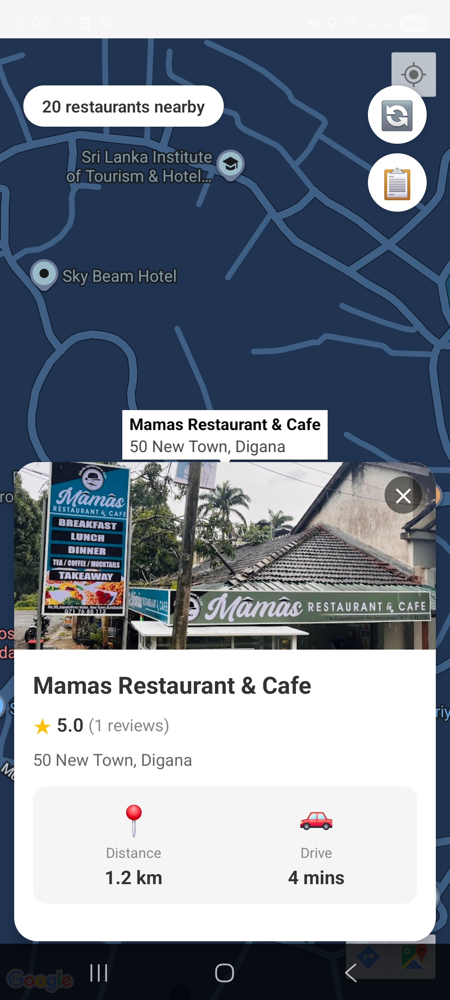
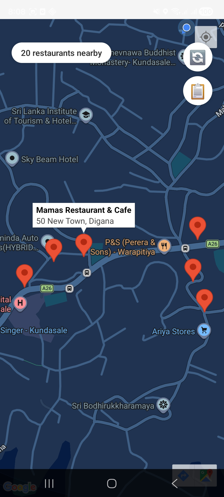
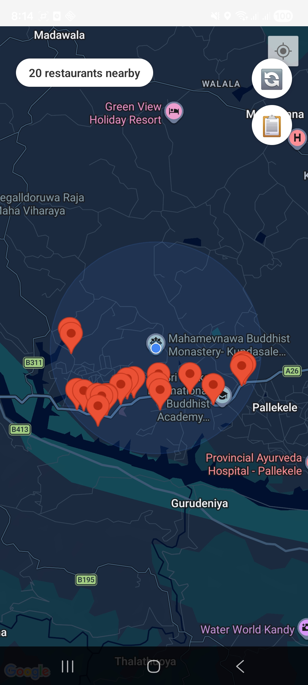

📍 Nearby Restaurant Finder
A high-performance React Native application that leverages Google Maps SDK and Google Places API to help users discover restaurants around their real-time location.

🚀 Features
Real-time Geolocation: Automatically detects user coordinates using @react-native-community/geolocation.

Interactive Maps: Full integration with react-native-maps (Google Maps Provider).

Places Integration: Fetches live data from the Google Places API, including names, ratings, and addresses.

Dynamic UI: A smooth, horizontal FlatList that allows users to scroll through restaurants and see them highlighted on the map.

Secure Configuration: Uses environment variables to keep sensitive API keys safe from version control.

🛠️ Tech Stack
Framework: React Native (CLI)

Language: TypeScript

Maps: react-native-maps

Location: react-native-geolocation-service

API Client: Axios / Fetch

Environment Mgmt: react-native-config or react-native-dotenv

📋 Prerequisites
Before running this project, ensure you have:

Node.js (v18 or higher)

Android Studio & SDK

Google Cloud Console Account with the following APIs enabled:

Maps SDK for Android

Places API

Geolocation API

A physical device or emulator with Google Play Services.

⚙️ Setup & Installation
1. Clone and Install
Bash
git clone https://github.com/your-username/qlab-assignment.git
cd qlab-assignment
npm install
2. Configure Environment Variables
Create a .env file in the root directory:

Code snippet
GOOGLE_API_KEY=your_api_key_here
3. Native Android Configuration
In android/app/src/main/AndroidManifest.xml, ensure your API key is linked:

<meta-data
  android:name="com.google.android.geo.API_KEY"
  android:value="YOUR_API_KEY_HERE" />
4. Run the App
Connect your device and run:

Bash
# In Terminal 1
npx react-native start --reset-cache

# In Terminal 2
npx react-native run-android

🛡️ Security Note
This project uses .gitignore to prevent the .env file and android/local.properties from being leaked. Never commit your Google API Key to a public repository.

## 📱 App Preview

|  |  |  |  | 